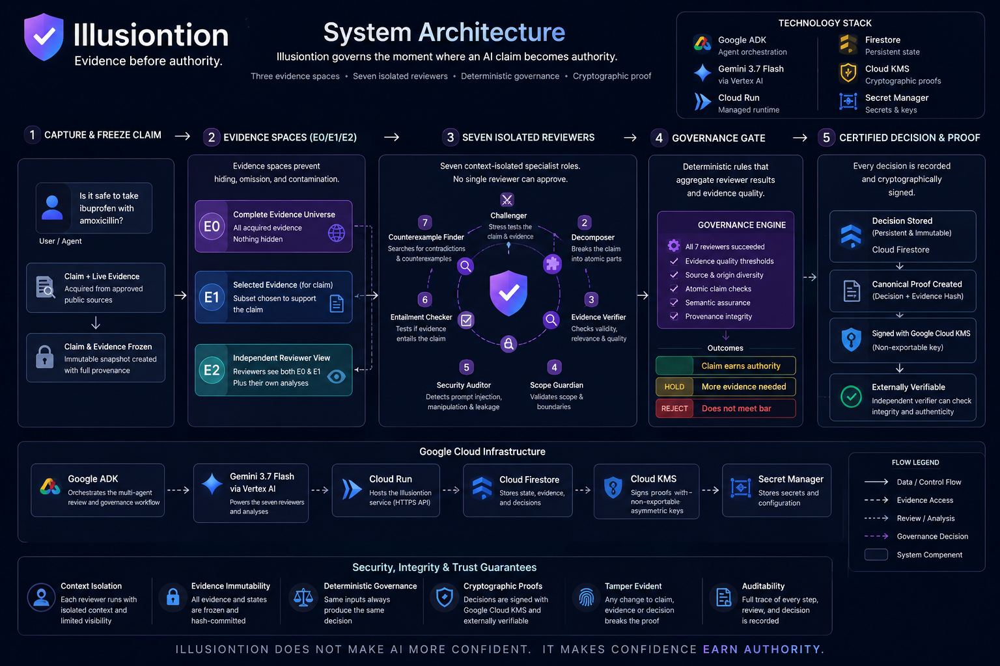
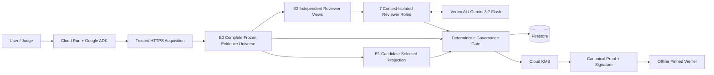

# Illusiontion

**Evidence before authority.**

Illusiontion is a Google ADK governed-review agent that prevents an AI claim from becoming authoritative merely because a model produced a persuasive answer. It separates model review from deterministic authorization and produces an independently verifiable decision proof.

## Hackathon category

**Fortified Enterprise Fleet**

## Required Google stack

- Google ADK — agent framework and orchestration
- Gemini 3.7 Flash via Vertex AI — reviewer model
- Cloud Run — deployed runtime
- Firestore — governed-decision persistence

Additional Google Cloud services include Cloud KMS, Secret Manager, Cloud Build, and Artifact Registry.

## Core flow

1. Acquire approved HTTPS evidence inside the trusted runtime.
2. Freeze the complete evidence universe.
3. Run context-isolated specialist review roles.
4. Apply deterministic evidence, provenance, semantic, and security gates.
5. Return PASS, HOLD, or REJECT.
6. Persist the governed decision to Firestore.
7. Sign a canonical proof using Google Cloud KMS.
8. Verify that proof independently offline.


## Reviewer independence boundary

The seven specialist roles are **independently invoked and context-isolated reviewer roles**.  
The frozen certified run uses **one configured model ID (`gemini-3.7-flash`) across those roles**. Illusiontion does not claim seven independent model providers.

## Fastest reproducibility check

No Google credentials or network access are required to verify the frozen proof bundle:

```bash
python -S proof_certification/verify_illusiontion_proof.py   proof_certification/r3-proof.json   proof_certification/r3-proof.sig   proof_certification/illusiontion-proof-public-key.pem
```

Expected final line:

```text
ILLUSIONTION_EXTERNAL_PROOF_VERIFIED
```

Run the full adversarial proof certification:

```bash
python -S proof_certification/certify_illusiontion_proof.py
```

Expected final line:

```text
ILLUSIONTION_EXTERNAL_PROOF_CERTIFICATION_PASS
```


## Architecture





The seven reviewer roles are independently invoked and context-isolated. The certified run uses one configured Gemini model ID across those roles.


## Repository layout

- `app/` — Google ADK runtime, reviewers, deterministic governance, evidence handling, persistence, and proof signing.
- `architecture/` — the single architecture image used in this README.
- `certification/final_pass/` — the frozen certified PASS case and its bound artifacts.
- `certification/conservative_hold/` — the frozen HOLD case showing successful execution without authorization.
- `proof_certification/` — standalone offline verifier, adversarial certifier, public verification key, proof, and signature.
- `pyproject.toml` — the single dependency/package definition.
- `Dockerfile` — local/container launch path.

## Local setup

Prerequisites:
- Python 3.11+
- Google Cloud credentials for the live Vertex/Firestore/KMS path

Create and activate a virtual environment:

```bash
python -m venv .venv
source .venv/bin/activate
```

Windows PowerShell:

```powershell
python -m venv .venv
.\.venv\Scripts\Activate.ps1
```

Install:

```bash
pip install .
```

Copy `.env.example` to `.env` and configure the Google Cloud project, model, KMS key version, evidence allowlist, and runtime secrets. Never commit secret values.


## Live deployment configuration

The public repository intentionally contains **no runtime secret values and no private signing key**.

For a live deployment you must provide:

- a Google Cloud project with Vertex AI, Cloud Run, Firestore, Secret Manager, and Cloud KMS configured;
- `ILLUSIONTION_RECEIPT_KEY` and `ILLUSIONTION_EVIDENCE_KEY` as secret-backed environment variables, each at least 32 bytes;
- your own Cloud KMS asymmetric signing key version in `ILLUSIONTION_PROOF_KMS_KEY_VERSION`;
- the SHA-256 pin of the corresponding public verification key in `ILLUSIONTION_PROOF_PUBLIC_KEY_SHA256`;
- an HTTPS evidence-origin allowlist.

The included `.env.example` contains safe placeholders for project/key-specific values and the public-source allowlist used by the certified demonstration.

## Run with Docker

```bash
docker build -t illusiontion .
docker run --rm -p 8080:8080 --env-file .env illusiontion
```

The Dockerfile starts:

```text
adk api_server --host 0.0.0.0 --port 8080 /agents
```

## Deploy to Cloud Run

```bash
gcloud auth login
gcloud auth application-default login
gcloud config set project YOUR_PROJECT_ID

gcloud run deploy illusiontion   --source .   --region YOUR_REGION   --no-allow-unauthenticated
```

The runtime service account must have the required Vertex AI, Firestore, Secret Manager, and Cloud KMS permissions.

## Demonstrated PASS and HOLD

`certification/final_pass/` contains the frozen certified PASS.  
`certification/conservative_hold/` contains a real HOLD where reviewer execution succeeded but evidence-source requirements were insufficient.
